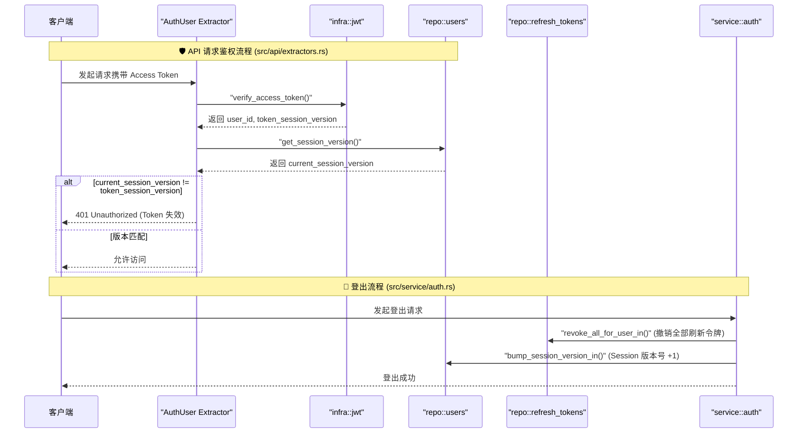

## 1. 高级摘要 (TL;DR)
*   **影响程度:** [高] - 本次提交对认证模块（JWT 校验和登出逻辑）进行了重大重构，增强了安全性，并修改了部分接口路由。
*   **核心变更:**
    *   **引入 Session Version 机制:** 在 `users` 表中增加 `session_version` 字段，并将其签发至 JWT Access Token 中。
    *   **增强登出与 Token 失效逻辑:** 登出时不仅撤销当前用户的**所有** Refresh Token，还会递增数据库中的 `session_version`，使已签发的所有 Access Token 立即失效。
    *   **全局接口鉴权配置:** 在 OpenAPI (Swagger) 中配置了全局 `bearerAuth` 鉴权，并排除了部分公开接口（如登录、注册等）。
    *   **用户删除 API 变更:** 将原有的 `DELETE /v1/users/{id}` 接口修改为 `POST /v1/users/{id}/delete`。

## 2. 可视化概览 (代码与逻辑映射)

以下时序图展示了引入 `session_version` 后的 JWT 校验以及全局登出（Logout）逻辑：

## 3. 详细变更分析

### 🔐 认证与会话管理 (`Auth Service` & `JWT`)
**变更逻辑:**
*   在生成 Access Token 时，将用户的 `session_version` 作为 `sv` 字段打包进 JWT payload 中（来源: `src/infra/jwt.rs`）。
*   在 `AuthUser` 提取器中，校验 JWT 签名后，额外查询数据库获取当前用户的最新 `session_version`，若与 Token 中的版本不一致，则拒绝访问（来源: `src/api/extractors.rs`）。
*   在登出逻辑中，开启事务，执行两个动作：1. 调用 `revoke_all_for_user_in` 撤销该用户的所有 Refresh Token；2. 调用 `bump_session_version_in` 将用户的 Session 版本号 +1（来源: `src/service/auth.rs`）。
*   在刷新 Token (`refresh`) 接口中，也会先查询数据库获取最新的 `session_version` 来签发新的 Access Token。

### 🌐 API 路由与文档 (`API Endpoints`)
**变更逻辑:**
*   更新了用户删除接口的 HTTP Method 和 Path。
*   通过 `utoipa` 添加了全局的 `bearerAuth` 安全机制，并为 `login`, `register`, `refresh`, `logout`, `ping` 等无需全局拦截的接口显式配置了 `security(())` 以绕过全局鉴权。

**API 变更明细:**
| 原接口路径 | 新接口路径 | 请求方法 | 变更说明 |
| :--- | :--- | :--- | :--- |
| `/v1/users/{id}` | `/v1/users/{id}/delete` | 由 `DELETE` 改为 `POST` | 修改了路由风格以避免直接使用 DELETE 方法 |

### 🗄️ 数据库架构 (`Database Schema` & `Repo`)
**变更逻辑:**
*   通过新的 SQL 迁移脚本在 `users` 表增加了新字段，并在代码层面的 `UserRow` 结构体中进行了映射。
*   添加了递增和查询 `session_version` 的仓储层方法。

**数据表结构变更:**
| 表名 | 新增字段 / 索引 | 类型 | 默认值 | 描述 |
| :--- | :--- | :--- | :--- | :--- |
| `users` | `session_version` | `bigint` | `0` | 用于控制 Access Token 有效性的版本号 |
| `users` | `users_session_version_idx` | `Index` | - | 加速查询 (条件: `deleted_at is null`) |

## 4. 影响与风险评估
*   ⚠️ **破坏性变更 (Breaking Changes):** 
    *   **客户端调用:** 用户删除接口由 `DELETE /v1/users/{id}` 变更为 `POST /v1/users/{id}/delete`，前端或客户端需要同步修改调用方式。
    *   **会话管理:** 用户的登出行为将变为**全局登出**（所有设备上的 Token 将同时失效），此变更会直接影响多设备登录的用户体验。
*   🧪 **测试建议:**
    1.  **单设备登出拦截测试:** 登录获取 Token -> 调用 Logout -> 再次使用原 Access Token 访问受保护接口，验证是否返回 401。
    2.  **多设备登出测试:** 模拟两个不同的会话（设备）登录同一账号 -> 设备 A 执行 Logout -> 验证设备 B 的 Access Token 和 Refresh Token 是否均不可用。
    3.  **用户删除接口:** 确保前端表单或管理后台使用 `POST` 方法正确调用 `/v1/users/{id}/delete`，验证删除功能正常。
    4.  **接口文档:** 检查 Swagger UI，验证受保护接口是否正确要求携带 Bearer Token，且公开接口不受影响。